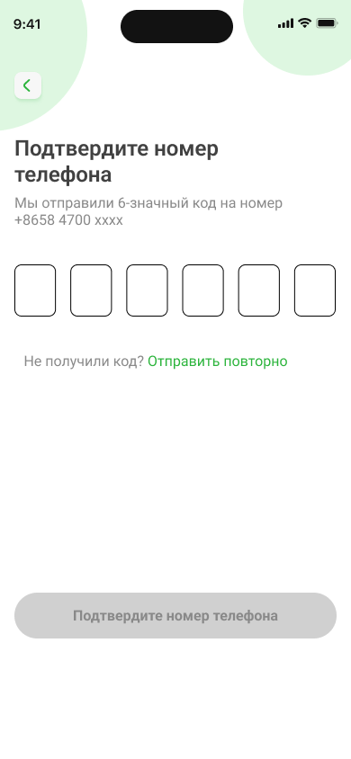

# Регистрация в Nova Bank

В Nova Bank можно зарегистрироваться только по электронной почте.

## Регистрация

1. На главном экране приложения Nova Bank нажмите **Регистрация**.
2. Выберите регистрацию по электронной почте.
3. Введите адрес вашей электронной почты.
4. Нажмите **Отправить код** — на указанную почту придёт письмо с кодом подтверждения.
5. Введите полученный код и нажмите **Подтвердить**.
6. Заполните необходимые данные (имя, дата рождения и т.д.) для завершения регистрации.
7. Создайте пароль, подтвердите его и нажмите **Зарегистрироваться**.

## Регистрация по номеру телефона:

1. На главном экране приложения Nova Bank нажмите **Регистрация**.
2. Выберите регистрацию по номеру телефона.
3. Заполните необходимые данные (имя, email, телефон)
4. Придумайте и введите пароль для входа в приложение банка.
5. Повторите пароль.
6. Поставьте галочку в окошке **"Создавая учетную запись, вы соглашаетесь 
с нашими условиями"**.
7. Нажмите кнопку **""Зарегестрироваться"**.
8. Затем нажмите кнопку **"Подвердить"** если номер, указаный на экране является верным. На этот номер придет смс с кодом подтвержения.
9. Нажмите кнопку **"Отмена"**,если номер неверный.
9. Дождитесь смс с 6-значным кодом, затем введите код из смс и нажмите кнопку **"Подтвердить номер телефона"**.
10. Если код не приходит, нажмите **"Отправить повторно"**.

После успешной регистрации вы сможете войти в личный кабинет, используя номер телефона или электронную почту вместе с установленным паролем.

# Авторизация через Госуслуги в Nova Bank

Вы можете авторизоваться в Nova Bank через Госуслуги:

1. Нажмите на иконку Nova Bank на главном экране вашего устройства.
2. Выберите **Войти в аккаунт**.
3. Нажмите на значок меню и выберите **Госуслуги**.
4. Введите свои учётные данные для Госуслуг и проверьте их актуальность.
5. Нажмите **Войти**.
6. На ваш номер придёт SMS с кодом подтверждения.
7. Введите код и нажмите **Продолжить**.
8. При необходимости введите пароль от вашего аккаунта или подтвердите вход через push-уведомление.
9. Нажмите **Продолжить** для завершения авторизации.

**Читайте также:**

- [Как перевести деньги по номеру карты](../payments/transfers.mdx)
- [Просмотр баланса и транзакций](../balance.mdx) 
- [Как восстановить пароль в Nova Bank](change-password.mdx)
