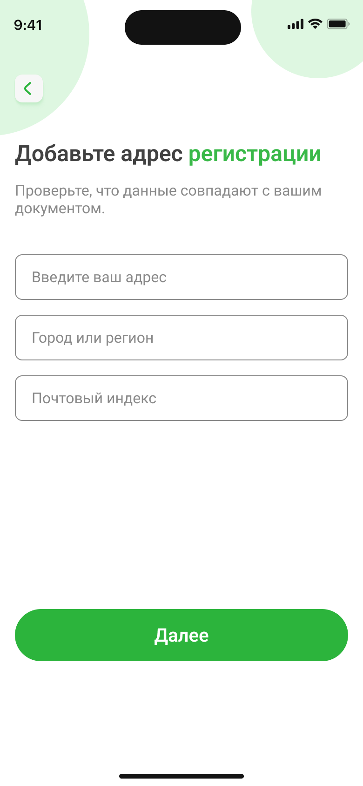
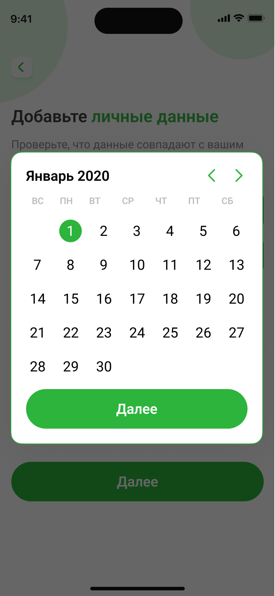

# Настройка аккаунта в приложении Nova Bank

После успешной регистрации и установки PIN-кода, заполните персональные данные. Это поможет активировать все функций приложения банка.Чтобы это сделать, откройте **Настройки**. Выберите **Настройки аккаунта**.

## Ввод персональных данных

1. Введите актуальный адрес вашей электронной почты,к которому будет привязан аккаунт приложения.Нажмите кнопку **Далее**.
2. Нажмите на выпадающий список **Выбрать тип учетной записи**.
3. Выберите тип учетной записи из предложенного списка. Нажмите кнопку **Далее**.
5. Введите адрес вашей регистрации, соответствующий адресу,указанному в вашем паспорте. Заполните необходимые данные (улица, дом,номер квартиры).
6. Введите название города или региона, в котором зарегистированы.
7. Введите 6 цифр почтового индекса города или региона, в котором зарегистрированы.Нажмите кнопку **Далее**.

8. Введите ваше имя, фамилию и отчество так, как указано в вашем паспорте.
9. Нажмите на поле, чтобы открыть календарь.Выберите месяц и год, используя стрелки навигации. Затем выберите число на календарной сетке. Когда данные отобразятся в формате *ДД.ММ.ГГГГ*, нажмите кнопку **Далее**.

После выполнения этих действий ваши данные будут сохранены в приложении.
